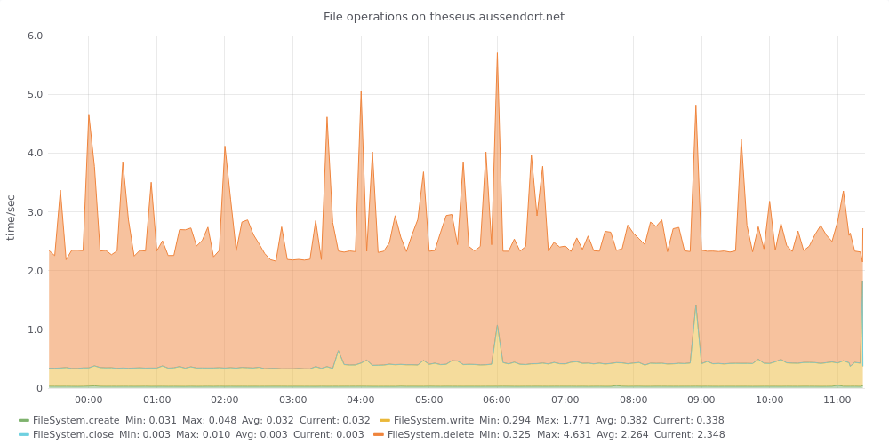

## Basic filesystem operations

This script measures the needed time for basic filesystem operations
- create a configurable number of files
- write a configurable number of bytes to each file
- close files
- delete files


For each step the time gets counted.

On success the measured times are transmitted to an InfluxDB and can be shown using a Grafana graph

### Prerequisites

You will need the Python Module influxd in order to transmit the data into your Influx database.

### Installation and configuration

Copy [test_fileSystemOperations.py](test_fileSystemOperations.py) into a directory of your choice.

Adapt the sample configuration file [fs_test.ini](fs_test.ini) to your needs:

```
[FS]
# Number of files to create/delete
numFiles=1000
# fileSize in Bytes
fileSize=1000000
testDir=/tmp

[Influx]
host=influxhost
port=8086
database=dbname
measurement=MySQL_Query
myhostname=mysql_hostname
```

### Run

To run the test and transmit the results, call `./test_fileSystemOperations.py fs_test.ini`

### Crontab

The [crontab.sample](crontab.sample) shows a way to run the test regularly:
```
PATH=/usr/local/bin:/usr/bin:/usr/local/sbin:/usr/sbin
*/5  *  *  *  *	      /usr/local/bin/test_fileSystemOperations.py fs_test.ini   
```

### Grafana Graph

The file [FilesystemGrafanaWidget.json](FilesystemGrafanaWidget.json) defines a Grafana-widget showing a stacked graph with measured operations.


