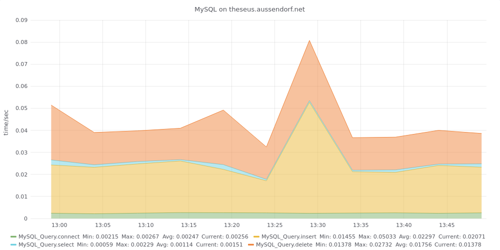

## MySQL Query end-to-end monitoring

This script uses the Python MySQL-Connector to 
- connect to MySQL
- insert a row
- select the created row
- delete the row again.

For each step the time gets counted.

On success the measured times are transmitted to an InfluxDB and can be shown using a Grafana graph

### Prerequisites

You will need the Python Module mysql-connector. Please learn more about this module here: https://dev.mysql.com/doc/connector-python/en/

You will need a MySQL user, who is able to connect, insert, select and delete from a dedicated table. The table needs to have at least the columns description(TEXT) and ts (INT(11)), can be created with 

`create table monitoring_tests ( id INT AUTO_INCREMENT PRIMARY KEY, description TEXT, ts INT(11) DEFAULT NULL);`

### Installation and configuration

Copy [test_MySQL_connection.py](test_MySQL_connection.py) into a directory of your choice.

Adapt the sample configuration file [MySQL.ini](MySQL.ini) to your needs:

```
[MySQL]
host=mysqlserver
database=dbname
table=monitoring_tests
user=monitor
password=xxx

[Influx]
host=influxhost
port=8086
database=dbname
measurement=MySQL_Query
myhostname=mysql_hostname
```

### Run

To run the test and transmit the results, call `./test_mySQL_connection.py MySQL.ini`

### Crontab

The [crontab.sample](crontab.sample) shows a way to run the test regularly:
```
PATH=/usr/local/bin:/usr/bin:/usr/local/sbin:/usr/sbin
*/5 * *  *  *     /usr/local/bin/test_mySQL_connection.py MySQL.ini
```

### Grafana Graph

The file [MySQLGrafanaWidget.json](MySQLGrafanaWidget.json) defines a Grafana-widget showing a stacked graph with measured operations.


