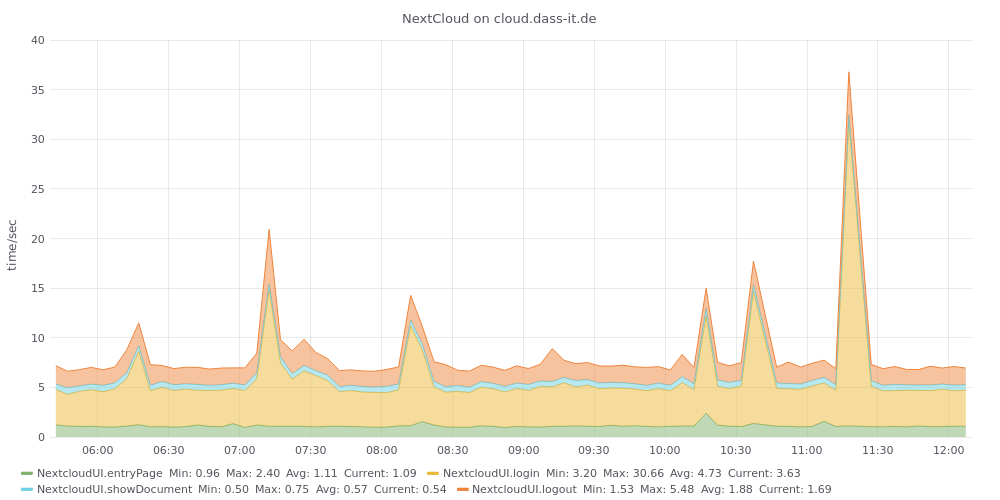

## NextCloud WebUI monitoring

This script uses Selenium to automatically run a browser, 
- login to Nextcloud
- open and display an image file
- close file
- logout

For each step the time gets counted.

On success the measured times are transmitted to an InfluxDB and can be shown using a Grafana graph

### Prerequisites

You will need the Python Module Selenium and a webdriver (geckodriver for example). Please learn more about the Python Selenium module here: https://pypi.org/project/selenium/

If you want to run the script unattended, you will need a virtual X-server Like *Xvfb*. See https://en.wikipedia.org/wiki/Xvfb for information.

### Installation and configuration

Copy [test_NextCloudUiLogin.py](test_NextCloudUiLogin.py) into a directory of your choice.

Adapt the sample configuration file *NextCloudUiLoginTest.ini* to your needs:

```
[NextCloud]
baseUrl=https://nextcloud.yourdomain.com
ncUser=monitor
ncPassword=password
loginForm=submit-form
# depending on Nextcloud version
# loginForm=submit

[Influx]
host=influxhost
port=8086
database=dbname
measurement=NextcloudUI
myhostname=nextcloud.yourdomain.com
```

### Run

To run the test and transmit the results, call `./test_nCOberonLogin.py NextCloudUiLoginTest.ini`

### Crontab

The *crontab.sample* shows a way to run the test regularly:
```
DISPLAY=:99
PATH=/usr/local/bin:/usr/bin:/usr/local/sbin:/usr/sbin
*/5 * *  *  *     /usr/local/bin/test_NextCloudUiLogin.py NextCloudUiLoginTest.ini
```

The *DISPLAY* variable reflects the display number used by the virtual X-server *Xvfb*.

### Grafana Graph

The file *NextcloudGrafanWidget.json* defines a Grafana-widget showing a stacked graph with measured operations.


