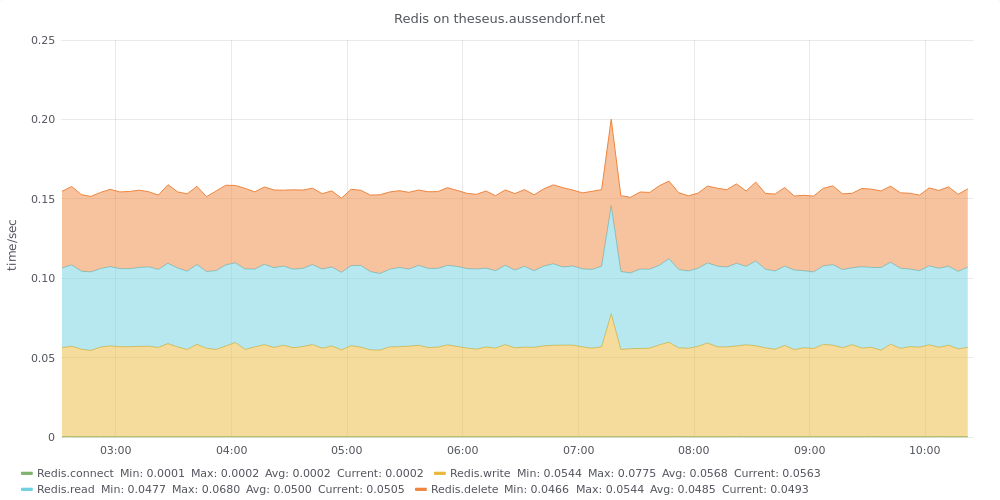

## Basic Redis operations

This script measures the needed time for basic Redis operations
- create a configurable number of keys with
- a configurable number of bytes for each value
- delete keys


For each step the time gets counted.

On success the measured times are transmitted to an InfluxDB and can be shown using a Grafana graph

### Prerequisites

You will need the Python Module influxd in order to transmit the data into your Influx database and Python3 Redis - see https://github.com/andymccurdy/redis-py for more information and details about the configuration of the redis connections.

### Installation and configuration

Copy [test_redis.py](test_redis.py) into a directory of your choice.

Adapt the sample configuration file [redis_test.ini](redis_test.ini) to your needs:

```
[RedisConnect]
# put any parameter here that Python's redis.Redis() constructor may accept
#host=localhost
#port=6379

[RedisTest]
# Number of files to create/delete
numKeys=1000
# keySize in Bytes
keySize=4096
# Just in case the scripts interrupts premature, set an expiration value for each key
keyExpiration=120000

[Influx]
host=influxhost
port=8086
database=test
measurement=FileSystem
myhostname=hostname
```

### Run

To run the test and transmit the results, call `./test_redis.py redis_test.ini`

### Crontab

The [crontab.sample](crontab.sample) shows a way to run the test regularly:
```
PATH=/usr/local/bin:/usr/bin:/usr/local/sbin:/usr/sbin
*/5  *  *  *  *	      /usr/local/bin/test_redis.py redis_test.ini   
```

### Grafana Graph

The file [RedisGrafanaWidget.json](RedisGrafanaWidget.json) defines a Grafana-widget showing a stacked graph with measured operations. You may have to adapt the datasource name.


